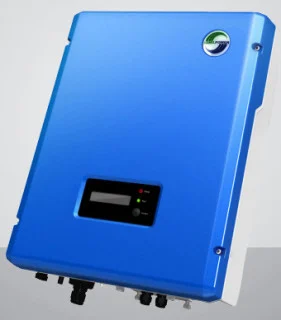
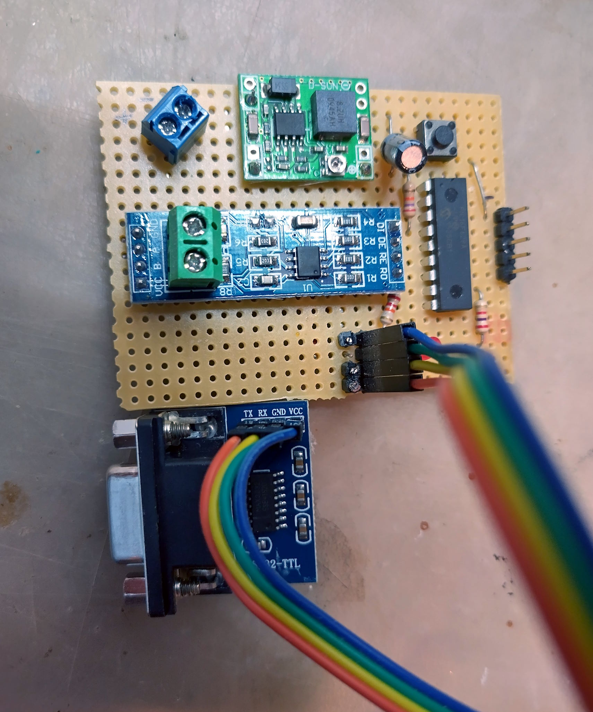

# Adapter for Samil Power SolarRiver Inverter

These notes are about the attempt of reverse-engineer the serial protocol used by the Samil Power SolarRiver 1100TL Inverter for solar panels.



## The protocol

The inverter has a handy RS-232 serial port to allow data loggers to be plugged-in.

Using the SolarPower Browser application for Windows connected to the inverter via a USB Serial port adapter, it was possible to log all the binary protocol messages using a virtual port analyzer. See [analysis.txt](./analysis.txt).

The bitrate is 9600, 8 bit data, 1 bit stop, no parity.

The messages exchange are quite simple:

```text
Broadcast Ask ID: 

0x55 0xAA  0x00 0x00  0x00 0x00  0x00 0x00  0x00  0x00 0xFF
```

This is the first message that the logger sends to the inverter, to get the inverter ID.

The structure of the message is:

- `0x55 0xAA` is the fixed header, common to all messages;
- `0x00 0x00` is the address of the source station (0 means broadcast, or the master node);
- `0x00 0x00` is the address of the destination station (0 means broadcast, so all the inverters are involved in the ask ID phase);
- `0x00 0x00` is the command to execute, "Ask ID" in this case;
- `0x00` is the number of bytes that follows, and that made the message body. The message is empty, so zero;
- `0x00 0xFF` is the checksum, as big endian (most significant byte first).

The checksum is calculated as 16-bit unsigned sum of all the preceding bytes, including the message header.

The inverter, if everything is ok, will respond with a response like this:

```text
Ask ID response

0x55 0xAA  0x00 0x00  0x00 0x00  0x00 0x80  <len>  <...N bytes...>   <checksum>
```

The structure of the response is the same of the request:

- `0x55 0xAA` is the fixed header;
- `0x00 0x00` is the address of the source station (the inverter), that is still zero since not logged in yet;
- `0x00 0x00` is the address of the destination station: it respond to the broadcast/master;
- `0x00 0x80` identifies the response to the "Ask ID" command. It seems that every valid response is always matching the request code, with the bit `0x00 0x80` set;
- `len` is the number of bytes that follows, that are a ASCII string identifying the inverter;


Once we have the ID string, we can then "Login" to that inverter:

```text
Login: 

0x55 0xAA  0x00 0x00  0x00 0x00  0x00 0x01  <ID len + 1>  <...N bytes of the ID...> 0x01   <checksum>
```

The structure of the message is, again:

- `0x55 0xAA` is the fixed header, common to all messages;
- `0x00 0x00` is the address of the source station, master = 0;
- `0x00 0x00` is the address of the destination station, that is still zero since not logged-in;
- `0x00 0x01` is the command to execute, "Login" in this case;
- `len + 1` is the number of bytes that follows, that are a ASCII string identifying the inverter plus an additional `0x01` byte, that is the address to assign to the inverter.

The inverter, if everything is ok, will respond with a response like this:

```text
Login response: 

0x55 0xAA  0x00 0x01  0x00 0x00  0x00 0x81  0x01  0x04  0x01 0x86
```

The structure of the response is the same of the request:

- `0x55 0xAA` is the fixed header;
- `0x00 0x01` is the address of the logged-in source station, so now 0x1 (big endian);
- `0x00 0x00` is the address of the destination station: it respond to the broadcast/master;
- `0x00 0x81` identifies the response to the "Login" command;
- `0x01` is the number of bytes that follows:
  - `0x6` is the payload of the login response message;
- `0x01 0x86` is the checksum.

After such data exchange, the SolarPower Browser application was issuing two additional commands that always has the same response, so I can assume that this is about serial numbers, protocol version, etc..

- Message `0x00 0x04` is the logout message;
- Message `0x01 0x00` is an empty message with a fixed 25 bytes response (self-test?);
- Message `0x01 0x02` is to ask real-time data about FV production;
- Message `0x01 0x03` returns some serial code and ASCII info about the firmware version.

and other unknown messages.

> There are for sure some administrative messages, since it is possible to configure the inverter parameter from the UI application (stuff like the country, the allowed range of frequencies, etc...).

The most useful message is the `0x01 0x02` about the production data. The response has the following structure:

```yaml
# Response, command 1/82h, PV data, array of 16-bit big endian:
0: 0000h:
1: 0485h: Panel1 DC Voltage in 0.1V: 115.7V
2: 0027h: Panel1 DC Current in 0.1A: 3.9A
3: 0000h:
4: 0000h:
5: 0001h:  Operating mode? 0: Wait, 1: Normal, 2: Fault, 3: Permanent
6: 0050h:  Energy today in 0.01kWh: 800Wh
7: 0000h:
...
18: 0000h:
19: 0014h:  Grid Current in 0.1A: 2.0A
20: 089ah:  Grid Voltage in 0.1V: 220.2V
21: 1388h:  Grid Frequency in 0.01Hz: 50.0Hz
22: 01c1h:  Output power in W: 449W
23:24: 000000fah:  Total energy in 0.1kWh: 25.0kWh
```

## The sample code

Some time ago, I wrote a naive network manager in C# to control a custom RS-485 based wired network, similar to ModBus but using 9-bit of data, leveraging [Microchip](https://www.microchip.com/) PIC 8-bit microcontrollers. The quite monorepo project can be found at [this tag](https://github.com/lmartorella/net/releases/tag/1.5).

The connection with the inverter was made with a custom PIC16F628 board, that was bridging the serial line with the RS-485 line. The midrange PIC series usually have only one USART implemented in hardware, so the second serial line is implemented with software bit banging.


<div align="center"><em><small>Prototype with onboard power regulator, ICSP connector, a RS485 module and a TTL-to-RS485 level adapter</small></em></div>

<br/>

The C# code you can find in this repository was extracted from that original project, and left as-is as a reference sample code. I've tried to polyfill it with some mock types just to let it to compile but without changing the history of the original sources.

I don't maintain it anymore, since the inverter was now dismissed, so this repo is read-only.
